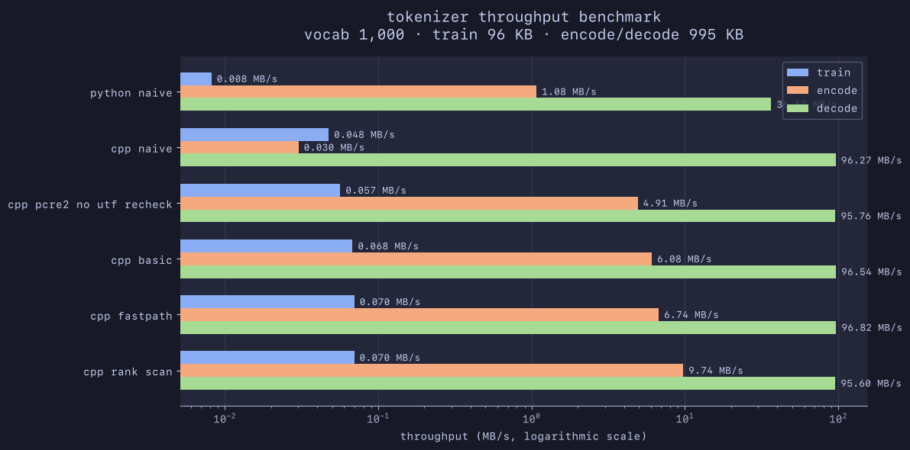

# Chatbot

An chatbot that visualizes different stages of an LLM. Built with privacy and education in mind! 

This project is an extension of my work in the [Gradcore](https://github.com/spacetimed/gradcore) repository, where I learned, designed, and implemented various language models, finally ending with a GPT-style transformer.

## Progress

**Phase 0: Preliminary** — *Complete*
- Created the project's environment (`pyproject.toml`, `pytest`, `venv`, etc).
- Imported my decoder-only GPT from `gradcore/`, and got the basics working.
- Some small smoke tests to ensure it trains.

**Phase 1: Upgrade to GPT-2-like Architecture** — *Complete*
- Molded the model in the direction of GPT-2. GPT-2-style implementations added:
    - Abstracted configuration into `GPTConfig`
    - Vectorized causal self-attention in `CausalSelfAttention` (removed `SingleHeadAttention`, `MultiHeadAttention`)
    - Added `MLP` with tanh-approximation GELU (same as GPT-2) (removed `FeedForward`)
    - Weight tying between input and output layers (`lm_head` and `token_embedding_table`)
    - Weight initialization with `std=0.02`, scaled by `1/√(2*num_layers)` for residual-output projections 
    - Rewrote `train.py` completely with basic checkpointing and a `TrainConfig` abstraction
        - Improved logging and analytics to prepare for system analyzing
        - Gradient clipping to combat exploding gradients
        - Decaying learning rate
        - AdamW configuration (similar to Karpathy's nanogpt)

**Phase 2: Tokenizer challenge, implemented in Python, C++, and Rust** — *In-progress*

- Preliminary: [Tokenizer specification that I wrote](docs/tokenizer.md)
    - The tokenizer will be created three times in each language: Python, C++, and Rust. 
    - It will be similar to the GPT-2 tokenizer, such as using the same Regex pattern.
    - The Python one serves as a naive tokenizer implementation, whereas the C++ and Rust serve as optimized performant rewrites.
    - Results will be benchmarked, and the most optimal implementation will be used in production.
    - The C++ and Rust variants will need to deterministically create the same output as the Python baseline (tested through their artifacts).
    - Different low-level optimization techniques can be used in both the C++ and Rust variants (e.g. SIMD), so long as the same output is created as Python.
    - *Why?* Curiosity, optimization is fun. And because a tokenizer is simple enough that it provides a nice exercise to toy with other languages.
- While working on the tokenizer, I upgraded the toy dataset from the Plato text used in Gradcore to streaming [FineWeb-Edu](https://huggingface.co/datasets/HuggingFaceFW/fineweb-edu) with HuggingFace datasets. 
- I rewrote `tokenizer_driver.py` to serve as a harness for running different language tokenizer implementations.
- I rewrote `tokenizer.py` (from my Gradcore repo) to be a naive and readable implementation for the C++ and Rust variants to follow. 
- Moved dataset loading to `dataset_loader.py` so that both `train.py` and `tokenizer_driver.py` can stream HF datasets.
- Long process of writing a naive variant of `tokenizer.cpp` (based off `tokenizer.py`). Around ~400 lines just for the same functionality, with the tedious part being Regex: C++ did not offer the same Regex capability as Python (specifically unicode property escapes required by the GPT-2 pretokenization pattern), so I had to import and use PCRE2. 
- Had some abstraction issues with `tokenizer_driver.py` so I delegated all I/O functions to that, instead of mixing I/O into the tokenizer scripts themself.

## Optimizing the tokenizer

The first two plots (`python naive`, `cpp naive`) are the naive implementations of my [Tokenizer specification](/docs/tokenizer.md). The `cpp naive` one specifically is pretty much a mirror of the Python one.

All plots below the first two are progressive iterations of my C++ tokenizer optimizations in chronological order. Most optimizations are discussed below.

**About the benchmark:** Uses FineWeb-Edu corpora to report median throughput in MB/s for:
1. Training a 1,000-token vocabulary on 96 KB across 3 repetitions.
2. Encoding 995 KB across 5 repetitions.
3. Decoding 995 KB across 20 repetitions.

**Optimization 1** — `cpp pcre2 no utf recheck`

- I noticed that Python's speed for `train, encode, decode` was roughly `slow, medium, fast` (respectively)—in terms of throughput. 
- The naive C++ tokenizer I wrote was (for some reason) `slow, *slower*, fast` in terms of the same sequence of operations; therefore, encoding was oddly slow. This is seen in the `cpp naive` benchmark.
- After profiling with `std::chrono` throughout the `encode_ordinary` function in the C++ file, I noticed a single call to pretokenization was insanely expensive. Something like 30 seconds for the bench.
- **What was unoptimized?** PCRE2 was validating the same unchanged UTF-8 input during every `pcre2_match()` call. I retained validation for the first match, but enabled `PCRE2_NO_UTF_CHECK` for subsequent matches.
- After including the disable check flag in the `match_options`, the median encoding latency went from `32.9089 s` to `0.2025 s`!
- Milestone: C++ tokenizer now faster than the Python implementation in all three modes!

**Optimization 2** — `cpp basic`

- This was mainly quick code cleanup (using `.reserve` to preallocate sufficient space for several data structures, small changes to an iterator).
- All modes actually had a meaningful boost (especially encode) for how trivial this set of optimizations was. 

**Optimization 3** — `cpp fastpath`

- At this point, I've realized my `encode_piece` (which is called on every pretokenized chunk) is a large bottleneck in the current code. It performs a lot of repeated work by naively re-scanning the entire sequence to apply merge rules.
- My plan is to add a local-rank optimization for `encode_piece` next, but before that, I wanted to see if I can prevent even calling this function for certain pretoken pieces.
- After assessing the tokenizer's training corpus, I discovered `51.66%` of the 197,355 pretokens already corresponded to a single vocabulary token. Because `encode_piece` simply wants to turn a "pretokenized piece" into a flat vector of tokens, we don't really need to apply merge rules if that pretokenized piece is a vocabulary token—it's already atomic. We can just quickly add the token ID corresponding to that word.
- I made a reverse map (`std::unordered_map<std::string, int> token_to_id`) which was basically an inverse of the `vocabulary` vector. It maps strings of any length (like `the`), to a token ID, if it exists in the vocabulary.
- Now, ~50% of pretokens in our corpus bypass the (currently) expensive `encode_piece` call, and get immediately encoded into their tokenized integer representation.
- This improved encoding-throughput from `6.08 MB/s` to `6.74 MB/s`, a `+10.86%` throughput improvement.

## Brainstorming

I plan to include as much of the stuff listed below in my project as I can. There's a lot I really want to learn, so I'm using this project as an opportunity to do just that.

Model / ML
- Privacy-focused deployment
- Graphic to visualize LLM computation (like a verbose ChatGPT lol)
- Re-use and substantially improve my from-scratch GPT
- Conversational/instructional fine-tuning
- Determine appropriate model size and training corpus
- Rent GPU for training
- Checkpointing and model versioning
- Custom Rust/C++ tokenizer implementation
- Custom CUDA kernel for one or more operations
- Benchmark custom implementations against PyTorch/reference versions

Inference
- GPU inference worker
- Token streaming
- Request queue
- Dynamic or continuous batching
- KV cache
- Generation controls
- Graceful cancellation / timeouts
- Measure tokens/sec, time-to-first-token, p50/p95 latency

Backend
- FastAPI
- REST API + SSE or WebSocket streaming
- PostgreSQL for users/conversations/model metadata
- Redis for caching / rate limiting
- Background job or message queue
- Retry / timeout / idempotency behavior
- Health/readiness endpoints

Frontend
- Next.js + TypeScript
- Streaming chat UI
- Conversation history

Infrastructure
- Docker
- AWS
- S3 for model checkpoints/artifacts
- EC2 GPU for inference if needed
- RDS PostgreSQL
- SQS for asynchronous jobs
- CI/CD with GitHub Actions
- Terraform
- Separate development / production configuration

Observability
- Structured logging
- OpenTelemetry
- Prometheus + Grafana OR AWS CloudWatch
- Request/inference metrics
- Error-rate and latency monitoring

Testing / reliability
- Unit tests
- Integration tests
- End-to-end tests
- Load testing
- Failure testing for queue/worker/model-service failures

## Note about AI usage

For this project, my reliance on AI tools is very constrained. AI tools will be used as bounded engineering assistants, rather than autonomous developers. 

All code and architectural decisions will be primarily my own. I'm using this to learn.

## References (todo, cite properly and hyperlink)
- [NanoGPT by Karpathy](https://github.com/karpathy/build-nanogpt)
- [GPT-2 Tokenizer by OpenAI](https://github.com/openai/gpt-2/blob/master/src/encoder.py)
- *Language Models are Unsupervised Multitask Learners* 
- *Attention Is All You Need*